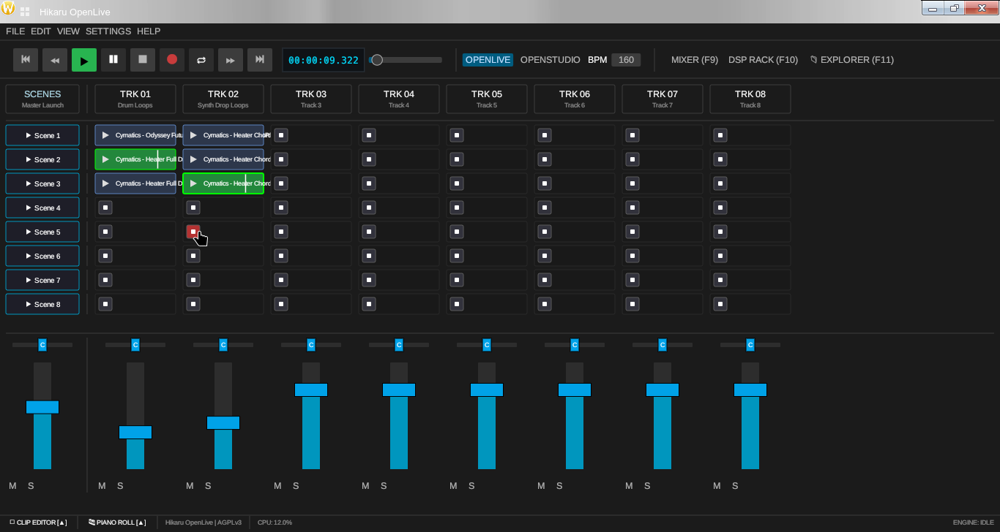
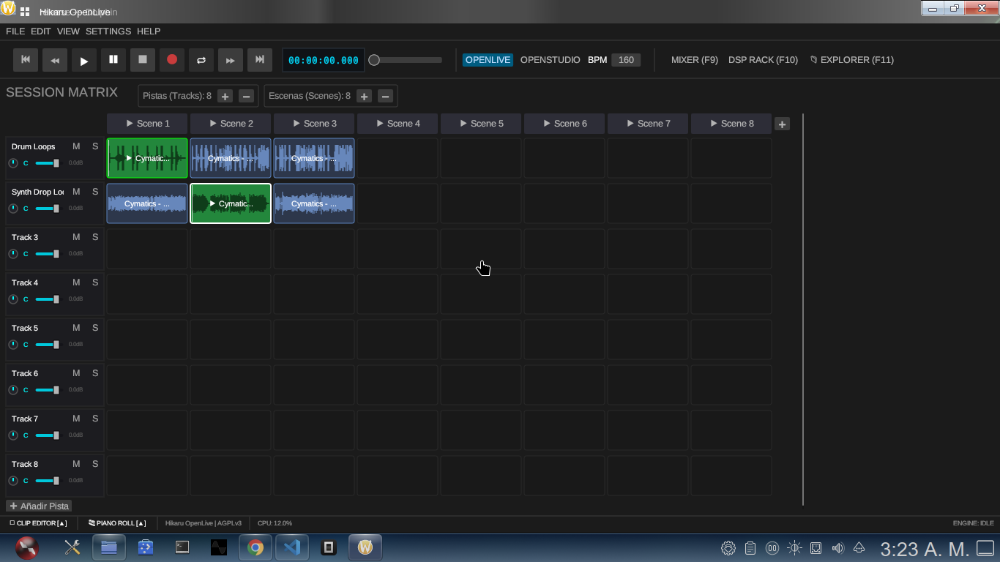
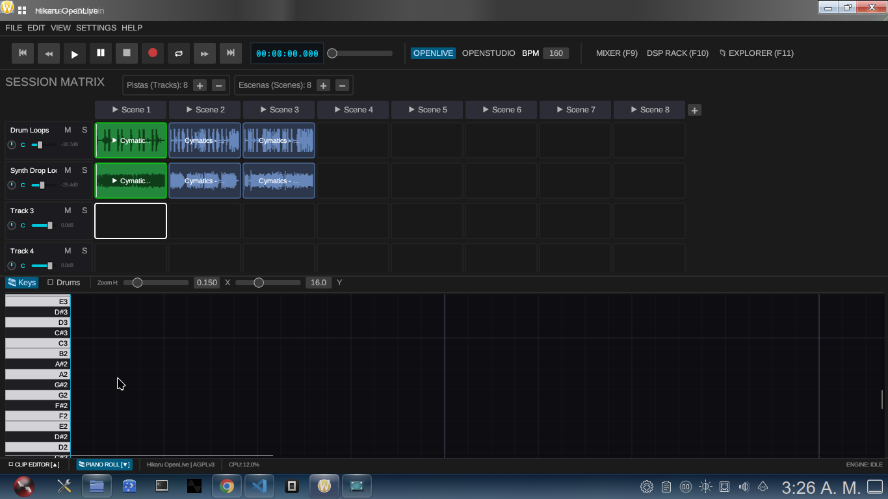
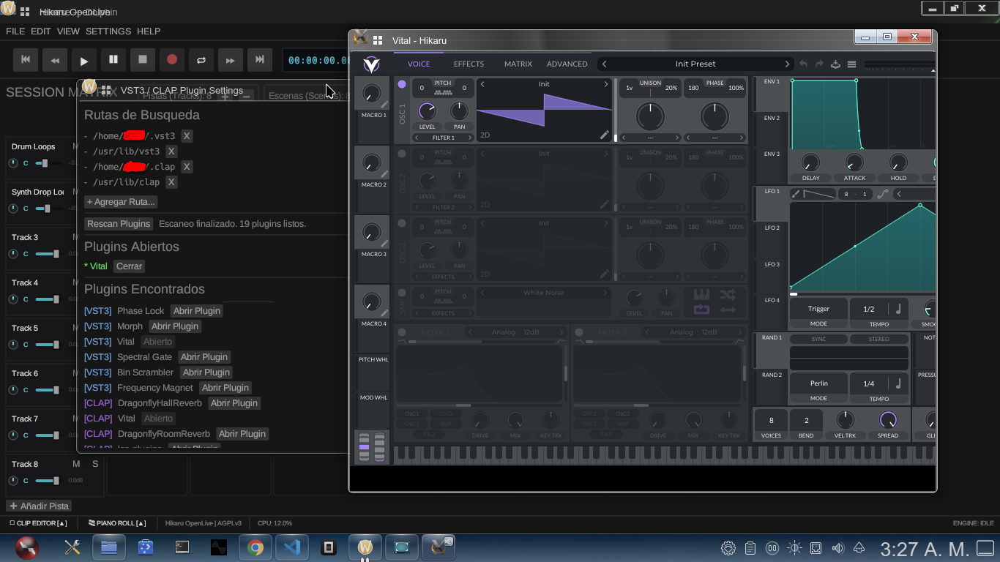

# Hikaru OpenLive

> DAW modular, libre y multiplataforma en Rust para producción musical en vivo y en directo.
> **Alternativa FOSS e independiente a Ableton Live y Bitwig Studio.** *(En desarrollo activo)*

[](https://www.gnu.org/licenses/agpl-3.0)
[](https://www.rust-lang.org)
[](#compilación-rápida-linux--debian--ubuntu)
[](https://github.com/emilk/egui)
[](https://github.com/RustAudio/cpal)

**Hikaru OpenLive** es una estación de trabajo de audio digital (DAW) diseñada para **actuaciones en vivo, lanzamiento de clips en tiempo real y composición lineal**. Construido completamente en Rust, ofrece un motor de audio de ultra baja latencia sin asignaciones de memoria dinámicas en el hilo crítico.

---

## 📸 Vista Previa

### Arranger View

*Línea de tiempo para composición tradicional, edición de pistas y arreglo lineal.*

### Session Matrix

*Grilla de clips al estilo Ableton/Bitwig para disparo cuantizado de escenas y waveforms en tiempo real.*

### Piano Roll & Editor MIDI

*Edición secuenciada de notas MIDI, edición de clips y control rítmico.*

### Host de Plugins VST3 / CLAP (Experimental/Beta)

*Carga y gestión de plugins de terceros en formato VST3 y CLAP.*

---

## 🚀 Características Principales

- **Session Matrix (Live Workflow):** Lanzamiento de clips por escenas, cuantización rígida y triggers instantáneos.
- **Arranger View:** Edición en línea de tiempo paralela a la matriz de sesión.
- **Motor de Audio sin Bloqueos:** Hilo de audio en tiempo real impulsado por CPAL y secuenciador sample-accurate.
- **DSP & Sintesis Nativa:** Racks de efectos (filtros, flanger, phaser) y generador wavetable integrado.
- **Host VST3 / CLAP:** Integración experimental para instrumentos y efectos externos.

---

## 🛠️ Compilación Rápida (Linux)

```bash
# Dependencias base (Debian/Ubuntu)
sudo apt update && sudo apt install -y build-essential pkg-config git libasound2-dev libx11-dev libgl1-mesa-dev

# Clonar y ejecutar
git clone https://github.com/hikarucorporation/hikaru-openlive.git
cd hikaru-openlive
cargo run --release -p hikaru_gui

```

## 🛠️ Compilación para un Release Completo (Linux)

En la carpeta raíz de tu proyecto (ej; `/miyu-shrine-workspace/*`)

```bash
cargo build --release --bin hikaru_openlive
```

---

## Compilación Cruzada para Windows (Cross-compilation)

Hikaru OpenLive puede compilarse directamente desde Linux para generar el ejecutable nativo de Windows (`.exe`) utilizando el target GNU de Rust.

### Requisitos previos

Asegurate de tener instalado el toolchain y el linker cruzado en Debian/Ubuntu:

```bash
# Instalar el toolchain de Rust para Windows x86_64
rustup target add x86_64-pc-windows-gnu

# Instalar el compilador MinGW-w64
sudo apt update && sudo apt install gcc-mingw-w64-x86-64

```

### Compilación

Para generar el ejecutable optimizado de producción:

```bash
cargo build --release --target x86_64-pc-windows-gnu -p hikaru_gui

```

El binario resultante se encontrará en:
`target/x86_64-pc-windows-gnu/release/hikaru_gui.exe`

### Pruebas en Linux (Wine)

Podés probar el ejecutable `.exe` directamente usando Wine:

```bash
wine target/x86_64-pc-windows-gnu/release/hikaru_gui.exe
```

---

# 🗺️ Roadmap & Próximos Pasos (para cambiar el framework grafico de **`egui`** a **`gpui-kit`**)

1. **Loopeo bugeado arreglado**: Creo que se rompió el crate `hikaru_audio_engine` y por eso el loopeo funciona como el ojete. **[LISTO]**
2. **Piano Roll Arreglado**: Porque el Piano Roll actual está rotisimo **[LISTO]**
3. **Input MIDI Virtual desde el Piano Roll**: eso **[LISTO]**
4. **Sintesis y Efectos Wavetable y Espectral**: eso tambien
5. **Hikaru OpenDMS arreglado como la gente**: Ahora está re bugeado XD **[LISTO]**
6. **Clips de Automatizaciones**: Medio parecidos al del FL Studio pero bueno jaja

---

## 👥 Comunidad y Colaboradores

Un agradecimiento especial a los gordos contribuyentes y a la comunidad de software libre que apoyan el desarrollo de **Hikaru OpenLive**:

* **Contributors:** [Ver lista de contribuyentes directos](https://github.com/hikarucorporation/hikaru-openlive/graphs/contributors)
* **Forks y derivados:** [Explorar forks de la comunidad](https://github.com/hikarucorporation/hikaru-openlive/network/members)

¿Querés aportar? ¡Los Pull Requests son más que bienvenidos! (Soporte MIDI, controladores físicos, timestretching y arreglos de bugs son prioridad total).

## Licencia

Este programa es software libre bajo los términos de la **GNU Affero General Public License (AGPLv3)**. Ver [`LICENSE`](https://www.gnu.org/licenses/agpl-3.0.en.html) para más detalles.

---

### Posdata:

Nota Personal: Cambiar el framework grafico de **`egui`** a **`gpui-kit`** cuando hagas la gran mayoría de cosas en **`egui`**